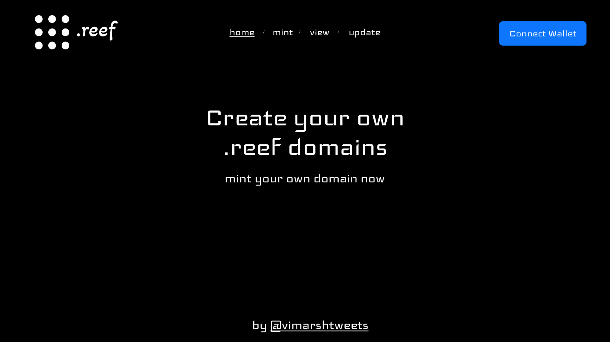
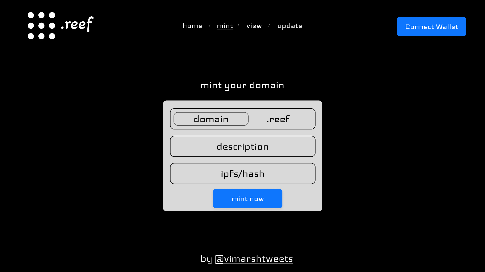
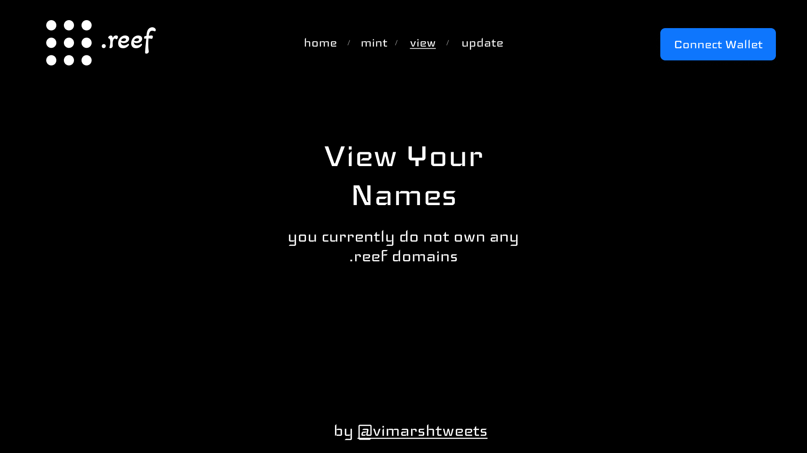
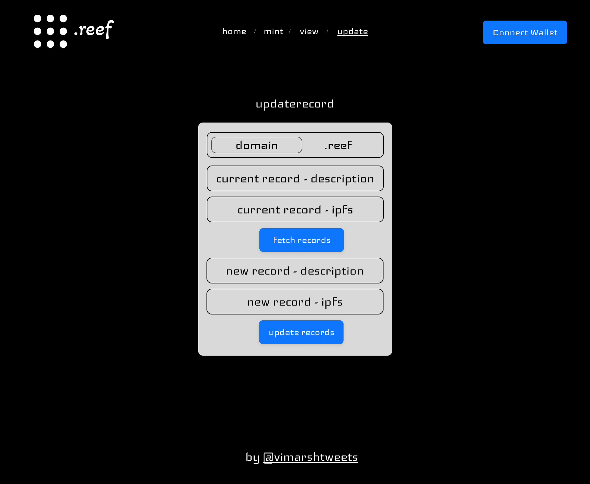

## About
Writing a smart contract for ens like functionality on [reef](https://reef.io/) blockchain. Also add UI to easily mint a .reef domain, set records & ipfs hash to resolve the domain.

## Structure of project
- domains: contains smart contract related files
- frontend contains the locofy.ai export inspired buildspace project frontend code.. but being in TS & next.js is causing many errors with polkadot wallet apis
-  crd: cloned from create-reef-dapp and WIP to integrate that with the design images shown below

## Work completed till now
- smart contract deployed on testnet (v0.2): https://testnet.reefscan.com/contract/0x155C0BD888a6CC037c2cc7b5eb5d6A26c3E6B10e
- tested & validated working on contract
- design made in figma and exported with use of locofy design tool
- wip frontend code (this is taking far too long) inspired from [here](https://github.com/anasshad/polygon-ens-domain-service)

## Design
page | designs
:-------------------------:|:-------------------------:
 |  
 |  

## Problems
- deploying smart contract to reef was not possible via reef hardhat cli tool, but happened quickly via [remix](https://remix.reefscan.com/)
- it takes me far to long to design UI: even though locofy helped, customizing and codifying it was difficult

## Future Improvements
- Make a domain resolver : aka something like domain.com/resolve/iamcool.reef -> ipfs content hash preview (dweb.link / cloudflare-ipfs)
- Make the domains annually renewable (something like what ens does)
- add functionality for subdomains (subdomain.iamcool.reef)
- ability to link multiple accounts & chains to single domain

## To-Do
- working web-app 😅